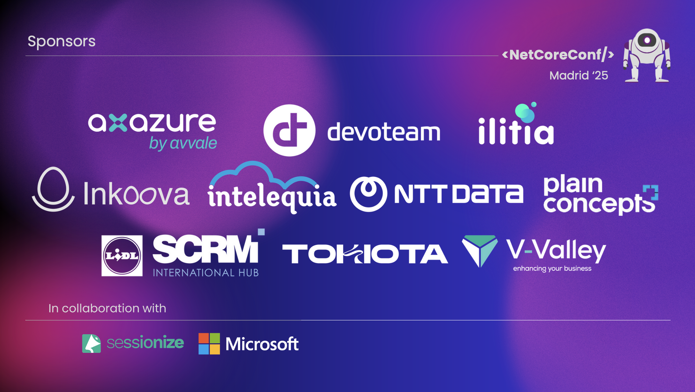

---
layout: about-me

helloMsg: Hola!
name: Andoni Santamaria
job: Developer at Plain Concepts, MVP de Microsoft
imageSrc: ./andoni.png

---

---
layout: cover
---

# Del aspire run al aspire deploy
## Pipelines as Code

Estandarización del ciclo de entrega con **.NET Aspire 13**

<!--
En esta charla veremos cómo aplicar Pipeline as Code para estandarizar el ciclo de entrega de cualquier tipo de aplicación, con un foco práctico en CI/CD y deploy: build reproducible, tests, empaquetado, seguridad, gestión de secretos/configuración, promoción entre entornos y despliegue automatizado usando Aspire 13
-->

---

# 🤔 ¿Por qué Pipeline as Code?

<v-clicks>

- **El problema**: Cada tecnología tiene sus propios comandos y herramientas
  - .NET: `dotnet restore`, `dotnet build`, `dotnet test`
  - JavaScript: `npm install`, `npm run build`, `npm test`
  - Python: `pip install`, `pytest`, `ruff check`
- **La realidad**: Las aplicaciones modernas son **polyglot**
- **El coste**: Equipos deben conocer todos los ecosistemas
- **La solución**: Un comando para gobernarlos a todos
  - `aspire do ci` ejecuta todos los pasos necesarios
  - `aspire deploy` despliega a producción
- **El beneficio**: Estandarización, reproducibilidad, simplicidad

</v-clicks>

<!--
El gran reto de las aplicaciones modernas es que raramente son monolíticas en un solo lenguaje. Tenemos backends en .NET, frontends en React/Vue, workers en Python, scripts en Go... y cada uno tiene su propio ecosistema de herramientas.

Aspire Pipelines viene a resolver esto: definir una vez, ejecutar en cualquier lugar.
-->

---
layout: center
---

# 🚀 El viaje del desarrollador

## aspire run → aspire do ci → aspire deploy

---

# 🔄 Fase 1: aspire run

## Desarrollo local simplificado

<v-clicks>

- **Dashboard integrado**: Observabilidad out-of-the-box
- **Orquestación de servicios**: Inicia todo con un comando
- **Telemetría automática**: Logs, métricas, trazas con OpenTelemetry
- **Service discovery**: Comunicación entre servicios simplificada
- **Configuración centralizada**: appsettings compartidos

```bash
cd src/aspire-pipelines.AppHost
aspire run
```

</v-clicks>

<!--
aspire run es el punto de partida del desarrollo. Con un solo comando tenemos toda la aplicación corriendo localmente con observabilidad completa. No más docker-compose manuals ni scripts de inicio complejos.
-->---

# 📊 Aspire Dashboard

<v-clicks>

- **Consola unificada** para todos los servicios
- **Logs en tiempo real** con filtrado inteligente
- **Métricas visualizadas**: CPU, memoria, requests
- **Traces distribuidos**: Seguimiento de requests entre servicios
- **Estado de salud**: Health checks integrados
- **Variables de entorno**: Configuración visible por servicio

</v-clicks>

<!--
El Aspire Dashboard es una herramienta poderosa que te da visibilidad completa de tu aplicación sin necesidad de configurar Grafana, Jaeger, o ELK stack. Todo incluido desde el primer día.
-->

---

# 🏗️ Definición de recursos en AppHost

```csharp {monaco}
#pragma warning disable ASPIREPIPELINES001

var builder = DistributedApplication.CreateBuilder(args);

// Backend .NET
var server = builder.AddProject<Projects.aspire_pipelines_Server>("server")
    .WithHttpHealthCheck("/health")
    .WithExternalHttpEndpoints();

// Frontend Vite + TypeScript
var webfrontend = builder.AddViteApp("webfrontend", "../frontend")
    .WithNpm(install: true)
    .WithReference(server)
    .WaitFor(server);

// Publicar frontend estático en el backend
server.PublishWithContainerFiles(webfrontend, "wwwroot");

builder.Build().Run();
```

<!--
Esta es la magia de Aspire: defines tus recursos como código y automáticamente se orquestan, se comunican, y se monitorizan. Nota el #pragma warning disable para características experimentales como Pipelines.
-->

---
layout: center
---

# ⚙️ Fase 2: aspire do ci

## Del código a la integración continua

---

# 🔧 Aspire Pipelines (Experimental)


---

# � Aspire Pipelines (Experimental)

<v-clicks>

- **Novedad en Aspire 13.1.0**: Pipeline as Code integrado
- **Feature experimental**: Requiere `#pragma warning disable ASPIREPIPELINES001`
- **Concepto**: Definir CI/CD como código en el AppHost
- **Beneficio**: Un comando para múltiples lenguajes/tecnologías

### Comandos disponibles:

```bash
aspire do setup    # Preparación del entorno
aspire do install  # Instalación de dependencias
aspire do lint     # Linting y formato
aspire do test     # Ejecución de tests
aspire do ci       # Pipeline completo (setup → install → lint → test)
```

</v-clicks>

<!--
Aspire Pipelines es la feature clave de esta charla. Permite definir todo el ciclo de CI/CD como código TypeScript/C# en el mismo lugar donde defines tu aplicación. Es experimental en 13.1, pero promete ser una revolución.
-->

---

# 🏗️ Estructura de CI Steps

```csharp {monaco}
public static class WellKnownCIStepNames
{
    public const string Setup = "setup";
    public const string Install = "install";
    public const string Lint = "lint";
    public const string Test = "test";
}
```

<v-clicks>

- **Setup**: Preparación del entorno (instalar uv, configurar SDK)
- **Install**: Instalación de dependencias (restore, npm install, uv sync)
- **Lint**: Verificación de formato y estilo (dotnet format, eslint, ruff)
- **Test**: Ejecución de tests (dotnet test, npm test, pytest)

</v-clicks>

<!--
Los steps siguen una convención clara y predecible. Cada step tiene un propósito bien definido y se pueden ejecutar independientemente o como parte del pipeline completo.
-->

---

# 🎯 Extensiones para .NET

```csharp {monaco}
public static class DotNetCIStepsExtensions
{
    public static IResourceBuilder<ProjectResource> WithRestoreStep(
        this IResourceBuilder<ProjectResource> builder)
    {
        return builder.WithCIStep(ctx =>
        {
            var resource = ctx.Resource;
            var stepName = $"dotnet-restore-{resource.Name}";
            
            ctx.Step = new PipelineStep
            {
                Name = stepName,
                Description = $"Restore {resource.Name}",
                RequiredBySteps = [WellKnownCIStepNames.Install],
                Implementation = async () =>
                {
                    await CLIHelper.RunProcess(ctx, "dotnet", 
                        ["restore"], WorkingDirectory: ".");
                }
            };
        });
    }
}

```

<v-clicks>

### Características clave:

- **Working Directory**: Usar `"."` para ProjectResource (encuentra la solution automáticamente)
- **Nombres únicos**: `"dotnet-restore-{resourceName}"` evita conflictos
- **Dependencias**: `RequiredBySteps` controla el orden de ejecución
- **CLIHelper**: Abstracción para ejecutar comandos CLI con logging

</v-clicks>

<!--
Cada extensión sigue el mismo patrón: recibe el resource builder, define un step con nombre único, y ejecuta el comando apropiado. El framework maneja las dependencias y el orden de ejecución.
-->

---

# 🧩 Más extensiones .NET

````md magic-move
```csharp
// Build step
public static IResourceBuilder<ProjectResource> WithBuildStep(
    this IResourceBuilder<ProjectResource> builder, 
    string configuration = "Release")
{
    return builder.WithCIStep(ctx =>
    {
        var resource = ctx.Resource;
        var stepName = $"dotnet-build-{resource.Name}";
        
        ctx.Step = new PipelineStep
        {
            Name = stepName,
            Description = $"Build {resource.Name}",
            DependsOnSteps = [$"dotnet-restore-{resource.Name}"],
            Implementation = async () =>
            {
                await CLIHelper.RunProcess(ctx, "dotnet", 
                    ["build", "--no-restore", "-c", configuration], 
                    WorkingDirectory: ".");
            }
        };
    });
}
```

```csharp
// Format check step
public static IResourceBuilder<ProjectResource> WithFormatCheckStep(
    this IResourceBuilder<ProjectResource> builder)
{
    return builder.WithCIStep(ctx =>
    {
        ctx.Step = new PipelineStep
        {
            Name = $"dotnet-format-{ctx.Resource.Name}",
            Description = $"Check format for {ctx.Resource.Name}",
            RequiredBySteps = [WellKnownCIStepNames.Lint],
            DependsOnSteps = [$"dotnet-build-{ctx.Resource.Name}"],
            Implementation = async () =>
            {
                await CLIHelper.RunProcess(ctx, "dotnet", 
                    ["format", "--verify-no-changes"], 
                    WorkingDirectory: ".");
            }
        };
    });
}
```

```csharp
// Test step
public static IResourceBuilder<ProjectResource> WithDotNetTestStep(
    this IResourceBuilder<ProjectResource> builder, 
    string configuration = "Release")
{
    return builder.WithCIStep(ctx =>
    {
        ctx.Step = new PipelineStep
        {
            Name = $"dotnet-test-{ctx.Resource.Name}",
            Description = $"Test {ctx.Resource.Name}",
            RequiredBySteps = [WellKnownCIStepNames.Test],
            DependsOnSteps = [$"dotnet-build-{ctx.Resource.Name}"],
            Implementation = async () =>
            {
                await CLIHelper.RunProcess(ctx, "dotnet", 
                    ["test", "--no-build", "-c", configuration], 
                    WorkingDirectory: ".");
            }
        };
    });
}
```
````

<!--
Cada método sigue el mismo patrón pero ejecuta diferentes comandos del CLI de .NET. La cadena de dependencias asegura que restore → build → format/test se ejecuten en el orden correcto.
-->

---

# 🟨 Extensiones para JavaScript

```csharp {monaco}
public static class JavaScriptCIStepsExtensions
{
    public static IResourceBuilder<NodeAppResource> WithInstallationStep(
        this IResourceBuilder<NodeAppResource> builder)
    {
        return builder.WithCIStep(ctx =>
        {
            var resource = ctx.Resource;
            var packageManager = GetPackageManager(resource);
            
            ctx.Step = new PipelineStep
            {
                Name = $"js-install-{resource.Name}",
                Description = $"Install dependencies for {resource.Name}",
                RequiredBySteps = [WellKnownCIStepNames.Install],
                Implementation = async () =>
                {
                    await CLIHelper.RunProcess(ctx, packageManager, 
                        ["install"], 
                        WorkingDirectory: resource.WorkingDirectory);
                }
            };
        });
    }
}
```

<!--
Para JavaScript, detectamos automáticamente si usas npm, yarn o pnpm y ejecutamos el comando apropiado. Mismo patrón, diferentes comandos.
-->

---

# 🐍 Extensiones para Python

````md magic-move
```csharp
// Setup global de uv (builder-level)
public static IDistributedApplicationBuilder AddUvPythonSetup(
    this IDistributedApplicationBuilder builder)
{
    builder.Pipeline.AddStep(new PipelineStep
    {
        Name = "setup-uv",
        Description = "Install uv globally",
        RequiredBySteps = [WellKnownCIStepNames.Setup],
        Implementation = async () =>
        {
            var isWindows = OperatingSystem.IsWindows();
            if (isWindows)
            {
                await CLIHelper.RunProcess(ctx, "powershell", 
                    ["-c", "irm https://astral.sh/uv/install.ps1 | iex"]);
            }
            else
            {
                await CLIHelper.RunProcess(ctx, "curl", 
                    ["-LsSf", "https://astral.sh/uv/install.sh", "|", "sh"]);
            }
        }
    });
    
    return builder;
}
```

```csharp
// Installation step
public static IResourceBuilder<PythonAppResource> WithUvInstallationStep(
    this IResourceBuilder<PythonAppResource> builder)
{
    return builder.WithCIStep(ctx =>
    {
        ctx.Step = new PipelineStep
        {
            Name = $"uv-sync-{ctx.Resource.Name}",
            Description = $"Install Python dependencies with uv for {ctx.Resource.Name}",
            RequiredBySteps = [WellKnownCIStepNames.Install],
            DependsOnSteps = ["setup-uv"],
            Implementation = async () =>
            {
                await CLIHelper.RunProcess(ctx, "uv", ["sync"],
                    WorkingDirectory: ctx.Resource.WorkingDirectory);
            }
        };
    });
}
```

```csharp
// Linting steps
public static IResourceBuilder<PythonAppResource> WithUvLintingSteps(
    this IResourceBuilder<PythonAppResource> builder)
{
    return builder.WithCIStep(ctx =>
    {
        ctx.Step = new PipelineStep
        {
            Name = $"uv-lint-{ctx.Resource.Name}",
            Description = $"Lint Python code with ruff for {ctx.Resource.Name}",
            RequiredBySteps = [WellKnownCIStepNames.Lint],
            DependsOnSteps = [$"uv-sync-{ctx.Resource.Name}"],
            Implementation = async () =>
            {
                await CLIHelper.RunProcess(ctx, "uv", 
                    ["run", "ruff", "check"],
                    WorkingDirectory: ctx.Resource.WorkingDirectory);
            }
        };
    });
}
```

```csharp
// Testing step
public static IResourceBuilder<PythonAppResource> WithUvTestingStep(
    this IResourceBuilder<PythonAppResource> builder)
{
    return builder.WithCIStep(ctx =>
    {
        ctx.Step = new PipelineStep
        {
            Name = $"uv-test-{ctx.Resource.Name}",
            Description = $"Run Python tests with pytest for {ctx.Resource.Name}",
            RequiredBySteps = [WellKnownCIStepNames.Test],
            DependsOnSteps = [$"uv-sync-{ctx.Resource.Name}"],
            Implementation = async () =>
            {
                await CLIHelper.RunProcess(ctx, "uv", 
                    ["run", "pytest"],
                    WorkingDirectory: ctx.Resource.WorkingDirectory);
            }
        };
    });
}
```
````

<!--
Python con uv es especialmente interesante porque necesitamos un setup global primero (instalar uv), y luego cada proyecto Python puede usar uv sync, ruff, y pytest. Soporte multi-plataforma incluido.
-->

---

# 🔗 Integración completa en AppHost

```csharp {monaco}
var builder = DistributedApplication.CreateBuilder(args);

// Setup global de Python
builder.AddUvPythonSetup();

// Backend .NET con CI steps
var server = builder.AddProject<Projects.aspire_pipelines_Server>("server")
    .WithHttpHealthCheck("/health")
    .WithExternalHttpEndpoints()
    .WithRestoreStep()
    .WithBuildStep()
    .WithFormatCheckStep()
    .WithDotNetTestStep();

// Frontend JavaScript con CI steps  
var webfrontend = builder.AddViteApp("webfrontend", "../frontend")
    .WithNpm(install: true)
    .WithReference(server)
    .WaitFor(server)
    .WithInstallationStep()
    .WithLintingStep();

// Habilitar CI
builder.WithCISteps();
```

<!--
Aquí es donde todo se une: defines tus recursos, añades los steps de CI con métodos fluent, y activas el sistema con WithCISteps(). Simple, legible, type-safe.
-->

---

# 📊 Pipeline CI agregado

```csharp {monaco}
builder.Pipeline.AddStep(new PipelineStep
{
    Name = "ci",
    Description = "Complete CI Pipeline",
    DependsOnSteps = [
        WellKnownCIStepNames.Setup,
        WellKnownCIStepNames.Install,
        WellKnownCIStepNames.Lint,
        WellKnownCIStepNames.Test
    ]
});
```

<v-clicks>

### Resultado:

```bash
aspire do ci  # Ejecuta: setup → install → lint → test
```

- Todas las tecnologías (.NET, JavaScript, Python)
- En el orden correcto de dependencias
- Con un solo comando
- Sin conocer los detalles de cada ecosistema

</v-clicks>

<!--
El step "ci" agregado es el que unifica todo. Define las dependencias entre stages y garantiza que se ejecuten en el orden correcto. Un comando para dominarlos a todos.
-->

---

# 🔐 Builds reproducibles

<v-clicks>

### global.json - Versión del SDK

```json
{
  "sdk": {
    "version": "10.0.100",
    "rollForward": "latestPatch"
  }
}
```

### Directory.Build.props - Propiedades comunes

```xml
<Project>
  <PropertyGroup>
    <TargetFramework>net10.0</TargetFramework>
    <Nullable>enable</Nullable>
    <TreatWarningsAsErrors>true</TreatWarningsAsErrors>
  </PropertyGroup>
</Project>
```

</v-clicks>

<!--
La reproducibilidad empieza con configuración versionada. global.json asegura que todos usen la misma versión del SDK. Directory.Build.props centraliza configuración común.
-->

---

# 📦 Central Package Management

```xml {monaco}
<Project>
  <PropertyGroup>
    <ManagePackageVersionsCentrally>true</ManagePackageVersionsCentrally>
    <AspireVersion>13.1.0</AspireVersion>
  </PropertyGroup>
  
  <ItemGroup>
    <PackageVersion Include="Aspire.Hosting" Version="$(AspireVersion)" />
    <PackageVersion Include="Aspire.Hosting.JavaScript" Version="$(AspireVersion)" />
    <PackageVersion Include="Aspire.Hosting.Python" Version="$(AspireVersion)" />
    <PackageVersion Include="Aspire.Hosting.Pipelines" Version="$(AspireVersion)" />
  </ItemGroup>
</Project>
```

<v-clicks>

### Beneficios:

- **Una sola fuente de verdad** para versiones de paquetes
- **Actualizaciones centralizadas**: Cambiar una vez, aplicar en todos los proyectos
- **Previene conflictos**: Todos los proyectos usan las mismas versiones

</v-clicks>

<!--
CPM es crucial en aplicaciones multi-proyecto. Evita el infierno de versiones incompatibles y centraliza las actualizaciones.
-->

---

# 🔒 Lock files para reproducibilidad

<v-clicks>

### .NET (NuGet)

```bash
dotnet restore --use-lock-file
# Genera packages.lock.json
```

### JavaScript (npm)

```bash
npm ci  # Instala desde package-lock.json
```

### Python (uv)

```bash
uv sync  # Usa uv.lock automáticamente
```

**Beneficio**: Garantiza que todos instalen las mismas versiones exactas de dependencias.

</v-clicks>

<!--
Los lock files son esenciales para reproducibilidad. Aseguran que el build de desarrollo, CI, y producción usen exactamente las mismas versiones de cada dependencia transitiva.
-->

---
layout: center
---

# 🐙 Integración con CI/CD

---

# GitHub Actions

```yaml {monaco}
name: CI/CD Pipeline

on:
  push:
    branches: [ main, develop ]
  pull_request:
    branches: [ main ]

jobs:
  ci:
    runs-on: ubuntu-latest
    steps:
      - uses: actions/checkout@v4
      
      - name: Setup .NET
        uses: actions/setup-dotnet@v4
        with:
          dotnet-version: '10.0.x'
          
      - name: Run CI
        run: |
          cd src/aspire-pipelines.AppHost
          aspire do ci
```

<!--
La integración con GitHub Actions es trivial: setup del SDK y ejecutar aspire do ci. Todo el conocimiento de cómo hacer CI para cada tecnología está en el AppHost, no en el pipeline YAML.
-->

---

# Azure DevOps Pipeline

```yaml {monaco}
trigger:
  branches:
    include:
      - main
      - develop

pool:
  vmImage: 'ubuntu-latest'

stages:
  - stage: CI
    displayName: 'Continuous Integration'
    jobs:
      - job: Build
        steps:
          - task: UseDotNet@2
            inputs:
              version: '10.0.x'
          
          - script: |
              cd src/aspire-pipelines.AppHost
              aspire do ci
            displayName: 'Run CI Pipeline'
```

<!--
Lo mismo para Azure DevOps. El pipeline YAML es mínimo y delegado en Aspire. Cambios en los steps de CI no requieren tocar el YAML del pipeline.
-->

---

# 🎯 Ventajas de Pipeline as Code

<v-clicks>

1. **Estandarización**: Un comando para todo el equipo
2. **Polyglot**: Soporta .NET, JavaScript, Python, y más
3. **Type-safe**: Definido en C#, con IntelliSense
4. **Versionado**: Los steps evolucionan con el código
5. **Local-first**: Mismo comportamiento local y en CI
6. **DRY**: No repetir comandos en múltiples YAMLs
7. **Testeable**: Los steps son código ejecutable localmente
8. **Mantenible**: Cambios centralizados en el AppHost

</v-clicks>

<!--
Esta es la propuesta de valor clave: mueves la complejidad del CI de múltiples archivos YAML dispersos a código C# centralizado, type-safe, y ejecutable localmente.
-->

---

# 🧪 Testing en el Pipeline

<v-clicks>

### Unit Tests

```csharp
.WithDotNetTestStep()  // xUnit, NUnit, MSTest
```

### Integration Tests con TestContainers

```csharp
public class IntegrationTests : IClassFixture<WebApplicationFactory>
{
    [Fact]
    public async Task GetWeatherForecast_ReturnsSuccess()
    {
        var response = await _client.GetAsync("/weatherforecast");
        response.EnsureSuccessStatusCode();
    }
}
```

### E2E Tests con Playwright

```typescript
test('homepage loads', async ({ page }) => {
  await page.goto('http://localhost:5000');
  await expect(page).toHaveTitle(/Aspire/);
});
```

</v-clicks>

<!--
El pipeline ejecuta tests a todos los niveles: unitarios para lógica, integration con TestContainers para APIs, y E2E con Playwright para flujos de usuario completos.
-->

---
layout: center
---

# 🚀 Fase 3: aspire deploy

## Del CI a la nube

---

# ☁️ Azure Container Apps

<v-clicks>

- **Servicio serverless** de Azure para containers
- **Auto-scaling**: De 0 a N instancias según demanda
- **Integración con Aspire**: Deployment nativo
- **Managed identity**: Seguridad sin secretos hardcodeados
- **DAPR integration**: Service-to-service communication
- **Azure service connectors**: SQL, Storage, Service Bus, etc.

```bash
cd src/aspire-pipelines.AppHost
aspire deploy
```

</v-clicks>

<!--
Azure Container Apps es el target de deployment recomendado para aplicaciones Aspire. Aspire genera automáticamente la infraestructura necesaria (Bicep) y despliega todo con un comando.
-->

---

# 🏗️ Arquitectura de Deployment

```
┌─────────────────────────────────────────────────┐
│         Azure Container Apps Environment        │
│                                                  │
│  ┌─────────────┐         ┌──────────────────┐  │
│  │   Server    │────────▶│   Webfrontend    │  │
│  │  (Backend)  │         │   (Frontend)     │  │
│  └─────────────┘         └──────────────────┘  │
│         │                                        │
│         ▼                                        │
│  ┌─────────────┐                                │
│  │  Azure SQL  │                                │
│  └─────────────┘                                │
└─────────────────────────────────────────────────┘
```

<v-clicks>

- **Container Apps Environment**: Aislamiento de red y recursos
- **Managed services**: Azure SQL, Redis, Service Bus
- **Ingress**: HTTPS automático con certificados managed
- **Service discovery**: Comunicación interna entre containers

</v-clicks>

<!--
Aspire despliega todos los servicios en un Container Apps Environment, configura la red interna, y conecta con servicios managed de Azure como SQL, Redis, etc.
-->

---

# 🔐 Gestión de Secretos

<v-clicks>

### Azure Key Vault

```csharp {monaco}
var builder = DistributedApplication.CreateBuilder(args);

// Referencia a Key Vault
var keyVault = builder.AddAzureKeyVault("keyvault");

// Obtener secreto
var connectionString = keyVault.GetSecret("SqlConnectionString");

// Usar en resource
var server = builder.AddProject<Projects.Server>("server")
    .WithEnvironment("ConnectionStrings__Default", connectionString);
```

### Managed Identity

- No hay credenciales hardcodeadas
- Las apps usan su identidad para acceder a Key Vault
- Rotación automática de secretos

</v-clicks>

<!--
Los secretos nunca van en appsettings ni variables de entorno en claro. Azure Key Vault + Managed Identity permiten acceso seguro sin credenciales.
-->

---

# 🔄 Configuración por Entorno

```csharp {monaco}
var builder = DistributedApplication.CreateBuilder(args);

var environment = builder.Configuration["ASPNETCORE_ENVIRONMENT"] ?? "Development";

if (environment == "Production")
{
    // Producción: Azure SQL
    var sql = builder.AddAzureSqlServer("sql")
        .AddDatabase("appdb");
    
    server.WithReference(sql);
}
else
{
    // Desarrollo: SQL Server en container
    var sql = builder.AddSqlServer("sql")
        .AddDatabase("appdb");
    
    server.WithReference(sql);
}
```

<!--
El AppHost puede tomar decisiones basadas en el entorno: containers locales para desarrollo, servicios managed para producción. Un solo código, múltiples configuraciones.
-->

---

# 🎭 Promoción entre Entornos

<v-clicks>

### Estrategia típica:

1. **Development** → Commit a `develop` → Auto-deploy a Dev
2. **Staging** → Merge a `main` → Auto-deploy a Staging
3. **Production** → Manual approval → Deploy a Prod

```yaml {monaco}
# GitHub Actions deployment
deploy-prod:
  runs-on: ubuntu-latest
  needs: [ci]
  if: github.ref == 'refs/heads/main'
  environment:
    name: production
    url: https://app.mycompany.com
  steps:
    - name: Deploy to Production
      run: |
        cd src/aspire-pipelines.AppHost
        aspire deploy \
          --environment production \
          --subscription ${{ secrets.AZURE_SUBSCRIPTION_ID }}
```

</v-clicks>

<!--
Los pipelines orquestan la promoción: CI automático en PRs, deploy automático a dev/staging, y deploy manual con aprobación a producción. Aspire simplifica cada deploy.
-->

---

# 📊 Observabilidad en Producción

<v-clicks>

### Application Insights

```csharp {monaco}
builder.Services.AddOpenTelemetry()
    .UseAzureMonitor(options =>
    {
        options.ConnectionString = builder.Configuration["ApplicationInsights:ConnectionString"];
    });
```

### Logs, Metrics & Traces

- **Logs estructurados**: Búsqueda y filtrado avanzado
- **Custom metrics**: Business KPIs
- **Distributed tracing**: Request flow entre servicios
- **Alerts**: Notificaciones por email/Teams/PagerDuty

### Dashboards

- **Azure Portal**: Metrics y logs integrados
- **Grafana**: Dashboards custom con PromQL

</v-clicks>

<!--
La telemetría configurada para desarrollo (OpenTelemetry) fluye automáticamente a Application Insights en producción. Visibilidad completa sin configuración adicional.
-->

---

# 🔄 Rollback y Blue-Green Deployment

<v-clicks>

### Revision Management

```bash
# Azure Container Apps mantiene revisiones
az containerapp revision list --name server --resource-group myapp-rg

# Rollback a revisión anterior
az containerapp revision activate \
  --name server \
  --resource-group myapp-rg \
  --revision server--abc123
```

### Traffic Splitting (Blue-Green)

```bash
# 50% tráfico a cada revisión
az containerapp ingress traffic set \
  --name server \
  --resource-group myapp-rg \
  --revision-weight server--old=50 server--new=50
```

</v-clicks>

<!--
Azure Container Apps mantiene historial de revisiones. Puedes hacer rollback instantáneo o gradual con traffic splitting para deployments de bajo riesgo.
-->

---

# 💰 Costos y Scaling

<v-clicks>

### Consumption Plan

- **Pago por uso**: $0 cuando no hay tráfico (scale to zero)
- **Auto-scaling**: Ajuste automático según CPU/memoria/requests
- **Mínimo**: 0 réplicas
- **Máximo**: Configurable (ej. 30 réplicas)

```csharp {monaco}
var server = builder.AddProject<Projects.Server>("server")
    .WithReplicas(min: 0, max: 10);  // Scale to zero
```

### Dedicated Plan

- **Workload profiles**: Recursos dedicados
- **Mejor para**: Cargas predecibles y constantes

</v-clicks>

<!--
Consumption plan es ideal para startups y aplicaciones con tráfico variable. Scale to zero reduce costos drásticamente en ambientes de desarrollo/staging.
-->

---
layout: center
---

# 🎬 Demo en Vivo

## De código a producción en minutos

---

# 🛠️ Checklist de Demo

<v-clicks>

1. **Local Development**
   ```bash
   aspire run  # Ver dashboard local
   ```

2. **CI Pipeline**
   ```bash
   aspire do ci  # Ver todos los steps ejecutarse
   ```

3. **Deployment**
   ```bash
   aspire deploy  # Desplegar a Azure Container Apps
   ```

4. **Verificación**
   - Revisar Azure Portal
   - Ver logs en Application Insights
   - Probar la app desplegada

</v-clicks>

<!--
En la demo, mostramos el ciclo completo: desarrollo local con dashboard, ejecución del CI con todos los steps visibles, deployment a Azure, y verificación en portal.
-->

---

# ✅ Beneficios Demostrados

<v-clicks>

1. **Simplicidad**: Un comando por fase
2. **Consistencia**: Mismo comportamiento local y remoto
3. **Rapidez**: De código a cloud en minutos
4. **Visibilidad**: Dashboard y telemetría out-of-the-box
5. **Seguridad**: Managed identity, Key Vault, HTTPS automático
6. **Escalabilidad**: Auto-scaling sin configuración
7. **Reproducibilidad**: Lock files y configuración versionada
8. **Polyglot**: .NET, JavaScript, Python en un solo pipeline

</v-clicks>

<!--
Esta es la promesa de Aspire: reduce drasticamente la complejidad del ciclo de entrega sin sacrificar flexibilidad ni control. Productividad sin magia negra.
-->

---

# 🚧 Limitaciones y Consideraciones

<v-clicks>

### Experimental (Aspire 13.1)

- **Pipelines es experimental**: API puede cambiar
- **Documentación limitada**: Early adopters territorio
- **Ecosistema en desarrollo**: No todos los lenguajes tienen extensiones

### Azure-centric

- **Deployment**: Optimizado para Azure Container Apps
- **Alternativas**: Kubernetes, AWS, GCP posibles pero menos integrados

### Curva de aprendizaje

- **Nuevo paradigma**: Pipeline as Code requiere cambio mental
- **Debugging**: Errores en steps pueden ser crípticos inicialmente

</v-clicks>

<!--
Aspire Pipelines es promisorio pero joven. Es experimental, tiene rough edges, y la documentación está catching up. Pero el potencial es enorme.
-->

---

# 🌐 Alternativas de Deployment

<v-clicks>

### Más allá de Azure Container Apps

1. **Docker Compose + SSH Deploy**
   - Deploy a servidores remotos via SSH
   - Ideal para VPS, on-premise, o infraestructura existente
   - Package: `Aspire.Hosting.Docker.SshDeploy`

2. **Kubernetes**
   - Deploy a clusters K8s (AKS, EKS, GKE)
   - Mayor control y portabilidad
   - Requiere más configuración

3. **AWS/GCP**
   - AWS ECS/Fargate o GCP Cloud Run
   - Menos integración nativa que Azure
   - Necesita configuración manual adicional

</v-clicks>

<!--
Aunque Azure Container Apps es la opción más integrada, Aspire soporta múltiples targets. Docker SSH Deploy es especialmente interesante para equipos que ya tienen infraestructura propia.
-->

---

# 🐳 Docker SSH Deploy - Overview

<v-clicks>

### ¿Qué es?

Extension de Aspire para desplegar aplicaciones dockerizadas a servidores remotos via SSH.

### ¿Cuándo usarlo?

- **VPS existente**: DigitalOcean, Linode, Hetzner
- **On-premise**: Servidores propios en datacenter
- **Infraestructura legacy**: Migración gradual sin reescribir todo
- **Presupuesto limitado**: VPS es más económico que PaaS/serverless

### Arquitectura

```
┌─────────────────────┐        SSH         ┌──────────────────────┐
│   Dev Machine / CI  │───────────────────▶│   Remote Server      │
│   aspire deploy     │                     │   docker compose up  │
└─────────────────────┘                     └──────────────────────┘
         │                                            │
         │ Build & Push                               │ Pull & Run
         ▼                                            ▼
┌─────────────────────┐                     ┌──────────────────────┐
│  Container Registry │────────────────────▶│   Running Containers │
│  (Docker Hub, ACR)  │                     │   (server, frontend) │
└─────────────────────┘                     └──────────────────────┘
```

</v-clicks>

<!--
SSH Deploy sigue el patrón tradicional de CI/CD pero orquestado por Aspire: build local, push a registry, pull en servidor remoto, y compose up.
-->

---

# 🔧 Configuración de SSH Deploy

````md magic-move
```bash
# 1. Añadir el package feed
dotnet nuget add source \
  https://f.feedz.io/davidfowl/aspire/nuget/index.json \
  --name davidfowl-aspire

# 2. Instalar el paquete
aspire add docker-sshdeploy
```

```csharp
// 3. Configurar en AppHost.cs
var builder = DistributedApplication.CreateBuilder(args);

// Definir recursos
var server = builder.AddProject<Projects.Server>("server")
    .PublishAsDockerFile();

var frontend = builder.AddViteApp("frontend", "../frontend")
    .PublishAsDockerFile();

// Habilitar SSH deployment
builder.AddDockerComposeEnvironment("prod")
    .WithSshDeploySupport();

builder.Build().Run();
```

```json
// 4. Configurar appsettings.json o variables de entorno
{
  "Deploy": {
    "SshHost": "your-server.com",
    "SshUser": "deploy-user",
    "SshKeyPath": "~/.ssh/id_rsa",
    "RemotePath": "/opt/myapp",
    "Registry": "myregistry.azurecr.io"
  }
}
```

```bash
# 5. Deploy
aspire deploy

# El pipeline ejecuta:
# - Build de imágenes localmente
# - Push al registry configurado
# - Conexión SSH al servidor
# - Transfer de docker-compose.yml y .env
# - docker compose up en el servidor remoto
# - Health checks
```
````

<!--
La configuración es directa: instalar package, añadir WithSshDeploySupport(), configurar credenciales SSH y registry, y deploy. Aspire maneja toda la orquestación.
-->

---

# 🆚 Comparación: Container Apps vs SSH Deploy

| Aspecto | Azure Container Apps | Docker SSH Deploy |
|---------|---------------------|-------------------|
| **Infraestructura** | PaaS managed | VPS/On-premise |
| **Costo inicial** | $0 (consumption) | Costo del VPS (~$5-50/mes) |
| **Escalabilidad** | Auto-scaling 0-N | Manual (recursos del servidor) |
| **Complejidad setup** | Mínima | Media (servidor + Docker + SSH) |
| **Vendor lock-in** | Azure | Ninguno (portable) |
| **Managed services** | SQL, Redis, etc. integrados | Self-hosted o servicios externos |
| **Observabilidad** | Application Insights incluido | Configurar manualmente |
| **SSL/HTTPS** | Automático | Configurar (Let's Encrypt) |
| **Rollback** | Revisiones + traffic split | Manual (docker compose down/up) |
| **Ideal para** | Startups, scale variable | Infraestructura existente, control total |

<!--
No hay una opción "mejor" universal. Container Apps es ideal para nuevos proyectos cloud-native. SSH Deploy es perfecto cuando ya tienes infraestructura o necesitas control total sin lock-in.
-->

---

# 🔐 Seguridad en CI/CD Pipelines

<v-clicks>

### Best Practices

1. **Secretos**
   - Nunca en código fuente (usar .gitignore)
   - Key Vault (Azure) o equivalentes (AWS Secrets Manager, HashiCorp Vault)
   - Variables de entorno en CI/CD pipelines

2. **Credenciales de Registry**
   - Service Principal con permisos mínimos (Azure)
   - IAM roles (AWS) o Service Accounts (GCP)
   - Rotar credenciales periódicamente

3. **SSH Keys**
   - Keys dedicadas por entorno (dev, staging, prod)
   - Sin passphrase para CI/CD (usar secrets management)
   - Restringir IP sources cuando sea posible

4. **Dependencies**
   - Escanear vulnerabilidades (npm audit, dotnet list package --vulnerable)
   - Lock files para reproducibilidad
   - Renovar dependencias regularmente (Dependabot, Renovate)

</v-clicks>

<!--
La seguridad no es opcional. Aspire facilita el deployment pero la responsabilidad de configurar credenciales de forma segura sigue siendo nuestra.
-->

---

# 🐛 Debugging y Troubleshooting

<v-clicks>

### Problemas Comunes y Soluciones

**1. CI Step falla sin mensaje claro**
```bash
# Ver logs detallados
aspire do <step-name> --verbose

# Ejecutar step individualmente
aspire do install  # Solo install, no todo el pipeline
```

**2. Build local funciona, CI falla**
- ✅ Verificar versión del SDK (global.json)
- ✅ Verificar lock files actualizados (packages.lock.json, package-lock.json, uv.lock)
- ✅ Limpiar caches: `dotnet clean`, `npm ci`

**3. Deploy falla en Azure**
```bash
# Ver logs del deployment
az containerapp logs show \
  --name myapp \
  --resource-group myapp-rg

# Ver estado de revisiones
az containerapp revision list \
  --name myapp \
  --resource-group myapp-rg
```

**4. Health checks fallan**
- ✅ Verificar endpoint health check accesible
- ✅ Revisar timeout configurado (por defecto 30s)
- ✅ Logs de la aplicación para errores de startup

</v-clicks>

<!--
Debugging de pipelines puede ser frustrante. Estas técnicas ayudan a identificar rápidamente dónde está el problema: local, CI, o deployment.
-->

---

# ⚡ Optimización de Performance

<v-clicks>

### CI Pipeline

1. **Cachear dependencias**
   ```yaml
   # GitHub Actions
   - uses: actions/cache@v4
     with:
       path: ~/.nuget/packages
       key: ${{ runner.os }}-nuget-${{ hashFiles('**/*.csproj') }}
   ```

2. **Paralelizar steps independientes**
   - Lint y Test pueden correr en paralelo
   - Multiple projects en paralelo (cuando son independientes)

3. **Incremental builds**
   - `dotnet build` con `--no-restore`
   - Webpack/Vite con cache habilitado

### Deployment

1. **Build de imágenes optimizado**
   - Multi-stage Docker builds
   - Layers cacheables (dependencies primero, código después)

2. **Registry en misma región**
   - Reduce latency de pull
   - Menos transferencia de datos = deploy más rápido

</v-clicks>

<!--
Performance importa en CI/CD. Un pipeline lento reduce la productividad del equipo. Estos optimizations pueden reducir tiempos de 10+ minutos a 2-3 minutos.
-->

---

# 📊 Métricas de CI/CD

<v-clicks>

### KPIs a Monitorear

1. **Lead Time for Changes**
   - Tiempo desde commit hasta producción
   - **Objetivo**: < 1 hora para hotfixes, < 1 día para features

2. **Deployment Frequency**
   - ¿Cuántas veces desplegamos a producción?
   - **Elite performers**: Multiple veces al día

3. **Change Failure Rate**
   - % de deployments que causan fallos
   - **Objetivo**: < 15%

4. **Mean Time to Restore (MTTR)**
   - Tiempo para recuperarse de un fallo
   - **Objetivo**: < 1 hora

### Herramientas

- **Azure DevOps**: Analytics incluido
- **GitHub**: Insights + GitHub Actions metrics
- **Custom**: Export a Prometheus/Grafana

</v-clicks>

<!--
Lo que no se mide, no se mejora. Estas métricas son estándares de la industria (DORA metrics) y ayudan a evaluar la madurez de tu proceso CI/CD.
-->

---

# 🔮 Futuro de Aspire Pipelines

<v-clicks>

### Roadmap público (GitHub)

- **Estabilización**: Salir de experimental en Aspire 14/15
- **Más lenguajes**: Go, Rust, Java extensions
- **Custom steps**: APIs para steps personalizados complejos
- **Visual designer**: UI para construir pipelines gráficamente
- **Multi-cloud**: Mejoras para AWS/GCP/on-prem

### Comunidad activa

- **Microsoft invirtiendo fuerte**: Team dedicado
- **Feedback welcome**: GitHub issues y discussions
- **Contribuciones**: Extensiones comunitarias emergiendo

</v-clicks>

<!--
Aspire es una apuesta estratégica de Microsoft. El roadmap es ambicioso y la comunidad está creciendo rápidamente. Vale la pena seguir de cerca.
-->

---

# 📚 Recursos y Referencias

<v-clicks>

### Documentación oficial

- [learn.microsoft.com/dotnet/aspire](https://learn.microsoft.com/dotnet/aspire)
- [GitHub: dotnet/aspire](https://github.com/dotnet/aspire)

### Deployment Alternatives

- [Aspire Docker SSH Deploy](https://github.com/davidfowl/aspire-ssh-deploy) - Deploy via SSH to any server
- [Azure Container Apps Docs](https://learn.microsoft.com/azure/container-apps/)

### Este proyecto

- **Repo**: github.com/andonisan/aspire-pipelines
- **Slides**: Disponibles en el repo
- **Código completo**: AppHost con extensiones personalizadas

### Comunidad

- **Discord**: Aspire community
- **Twitter**: #dotnetaspire
- **YouTube**: .NET Foundation channel
- **Blog posts**: Buscar "aspire pipelines" en Dev.to, Medium

</v-clicks>

<!--
Toda la documentación y código están públicos. El proyecto de esta charla es un template reutilizable para tus propias aplicaciones. SSH Deploy es una alternativa interesante para infraestructura existente.
-->

---

# ✨ Conclusiones

<v-clicks>

1. **Pipeline as Code** es el futuro del CI/CD
2. **Aspire Pipelines** unifica desarrollo, CI y deployment
3. **Un comando por fase**: `run`, `do ci`, `deploy`
4. **Polyglot support**: .NET, JS, Python... en un solo pipeline
5. **Azure Container Apps**: Deployment simplificado y escalable
6. **Observabilidad incluida**: OpenTelemetry y Application Insights
7. **Reproducibilidad**: Lock files y configuración versionada
8. **Experimental pero prometedor**: Adopción temprana vale la pena

### 💡 Takeaway

> **Del desarrollo a producción con tres comandos, sin conocer los detalles de cada tecnología.**

</v-clicks>

<!--
La propuesta de valor es clara: reduce la fricción del ciclo de entrega sin sacrificar control. Es la promesa de Aspire cumplida.
-->

---
layout: center
---

# 🙏 ¡Gracias!

## ¿Preguntas?

<br/>

📩 [asantamaria@plainconcepts.com](mailto:asantamaria@plainconcepts.com)  
🐦 X @AndoniSantamari  
🔗 github.com/andonisan/aspire-pipelines

<br/>

**Código de esta charla**: github.com/andonisan/aspire-pipelines

---

